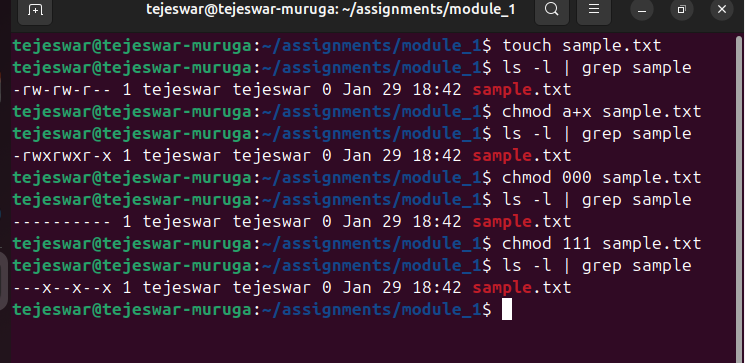
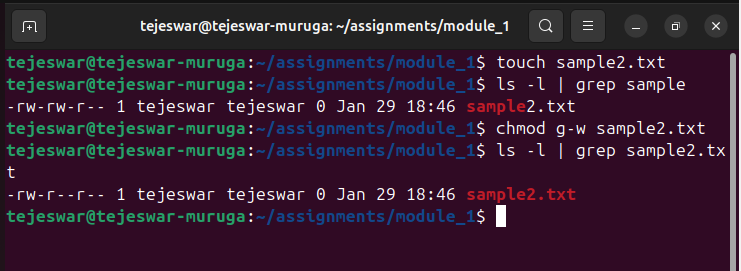
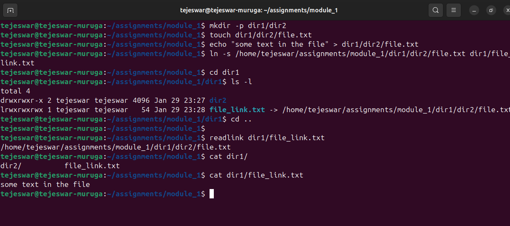
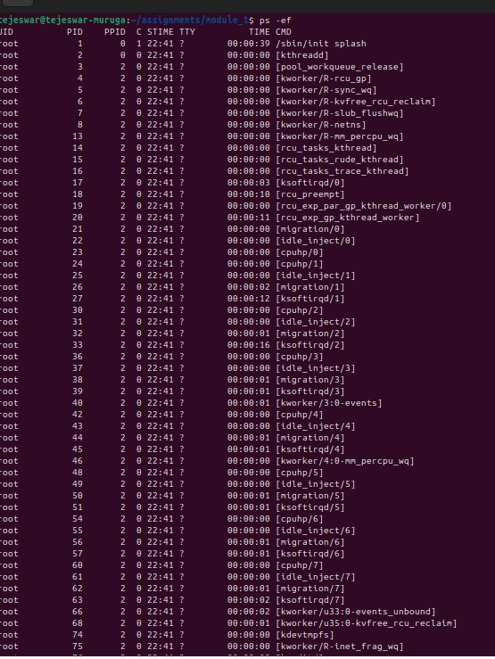
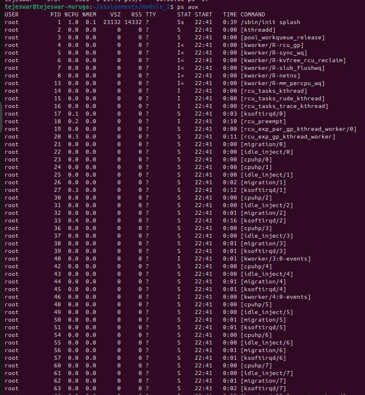
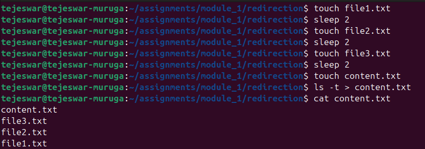

### Module 1 Assignments
### 1) Create a file and add executable permission to all users (user, group and others)

1) Create a file using the command:

   ```shell
   touch sample.txt
   ```
2) List the content of directory and use grep to filter the file created and view the permissions:
    ```shell
   ls -l | grep sample
   ```
3) Modify the permission, to provide executable permission to all users using:

   ```shell
   chmod a+x sample.txt
   ```

   where, `a` - all users and `x` - executable permission

4) Now view the permissions of all users using the list command. You will find the executable permission available to all users, denoted by the `x`
           
   



### 2) Create a file and remove write permission for group user alone

1) Create a file using the command:

   ```shell
   touch sample2.txt
   ```
2) View the current permissions present using

   ```shell
   ls -l | grep sample
   ```

3) Remove the write permission (w) for all group user, using the command

   ```shell
   chmod g-w sample2.txt
   ```
4) Again view the permissions, to find that the write permission is removed for group user.



### 3) Create a file and add a softlink to the file in different directory (Eg : Create a file in dir1/dir2/file and create a softlink for file inside dir1)

1) Create the directory `dir1` and sub-directory by the command:

   ```shell
   mkdir -p dir1/dir2
   ```
   
2) create a file named file.txt inside dir2 as:

   ```shell
   touch dir1/dir2/file.txt
   ```
   
3) Write some text inside the created file:

   ```shell
   echo "some file content" > dir1/dir2/file.txt
   ```

4) Create a soft link to the file 'file.txt' using the command:

   ```shell
   ln -s /home/tejeswar/assignment/module_1/dir1/dir2/file.txt dir1/file_link.txt
   ```

6) Check the soft link by :

   ```shell
   readlink dir1/file_link.txt
   ```
   It should display the path of the original file
   
8) Display the content of the link file, to check if it is same as original file



### 4) Use ps command with options to display all active process running on the system           

1) List all the proceess running in the machine through the below command:

     ```shell
     ps -ef
     ```

     

2) This can also be achieved by:

   ```shell
   ps -aux
   ```

   

### 5) Create 3 files in a dir1 and re-direct the output of list command with sorted by timestamp of the files to a file

1) Ceate 3 files using the using `touch` command, and leave some time between file creating using `sleep`:

   ```shell
   touch file1.txt
   sleep 2
   touch file2.txt
   sleep 2
   touch file3.txt
   sleep 2
   ```
2) Create a file to re-direct the output of list command -> `content.txt`
3) Re-direct the putput of list command, sorted based on timeline as:
   ```shell
   ls -t > content.txt
   ```
4) View the content of the file:
   ```shell
   content.txt
   ```

   
