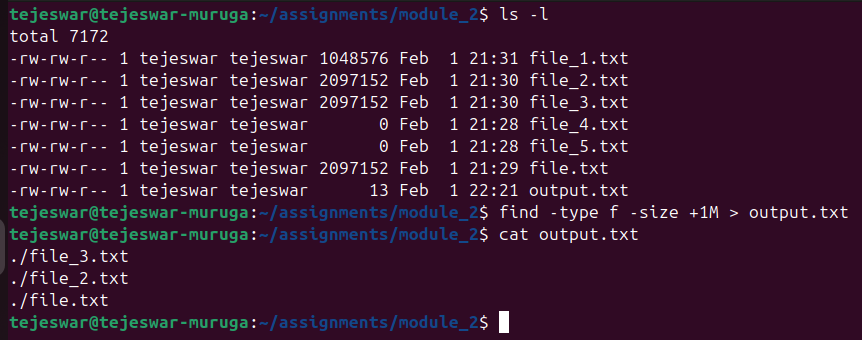
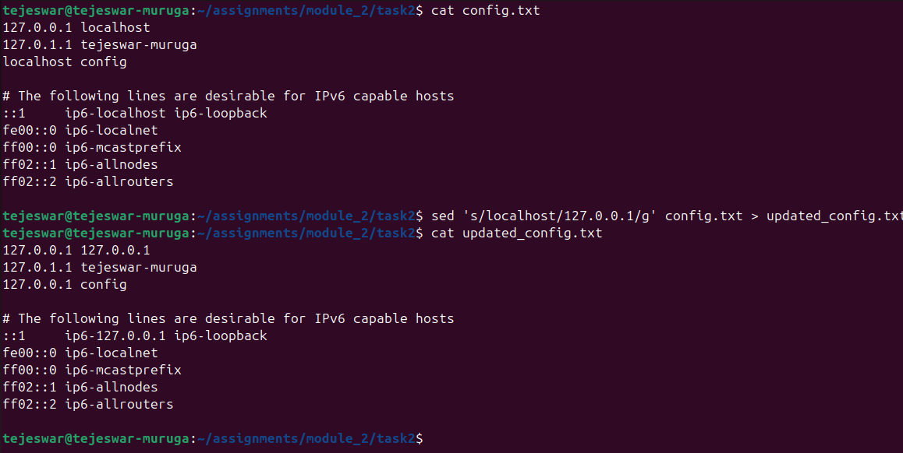
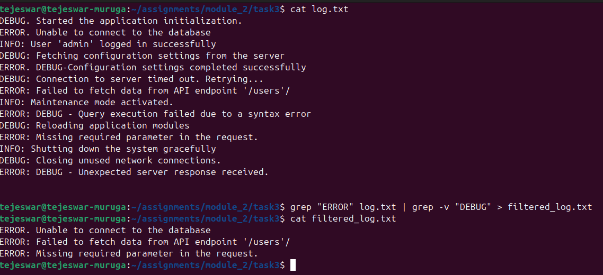
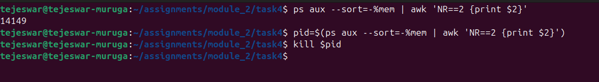

### Module 2 Assignments

#### 1. Use the appropriate command to list all files larger than 1 MB in the current directory and save the output to a file.

1. Use the `find` command to find the file with size more than 1MB 
2. Redirect the output to a file called `output.txt`
3. display the contents of the file using `cat` command



#### 2. Replace all occurrences of "localhost" with "127.0.0.1" in a configuration file named config.txt, and save the updated file as updated_config.txt.

1. Display the contents of the config file
2. substitute the contents of the file, and redirect the output to a file, using the `sed` command as:

    ```shell
    sed 's/localhost/127.0.0.1/g' > updated_config.txt
    ```
3. display the contents of `output.txt`




#### 3. Use the appropriate command to search for lines containing the word "ERROR" in a log file but exclude lines containing "DEBUG". Save the results to a file named filtered_log.txt.

1. Display the contents of the log using `cat log.txt`
2. Use the `grep` command to filter the lines containing 'ERROR' , and pipeline it to another `grep` which removes the lines containing the string 'DEBUG'. Redirect thr output to a file:

    ```shell
    grep "ERROR" log.txt | grep -v "DEBUG" > filtered_log.txt
    ```



#### 4. Write a code to identify the process with the highest memory usage and then terminate it.

1. Order all theprocess, and sort them in descending order of memory uage using `ps aux --sort=-%mem` command and pipeline it to `awk` to get the PID :

    ```shell
    ps aux --sort=-%mem | awk 'NR==2 {print $2}'
    ```

2. Store the PID in a variable 

    ```shell
    pid=$(ps aux --sort=-%mem | awk 'NR==2 {print $2}')
    ```

3. Kill the process using `kill` command
    ```shell
    kill pid
    ```



#### 5. Use the networking tool command and print all the gateway available in a sorted manner.

1. Use the `ip route` to get the gateway information. The default gateway needed beigins with 'default'. Filter the lines starting with default using `awk` and get the gateway IP address and sort them:

    ```shell
    ip route | awk '/default/ {print $3}' | sort 
    ```

